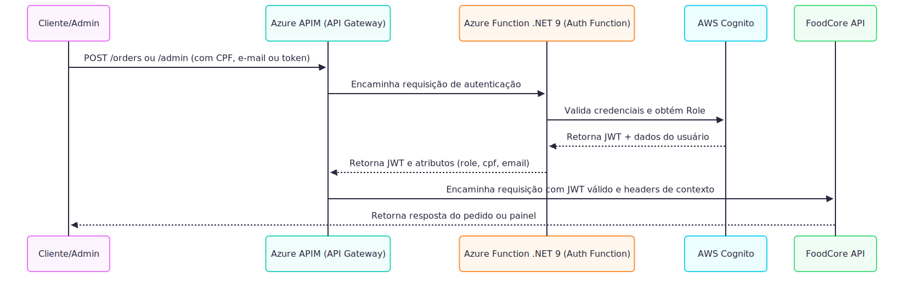
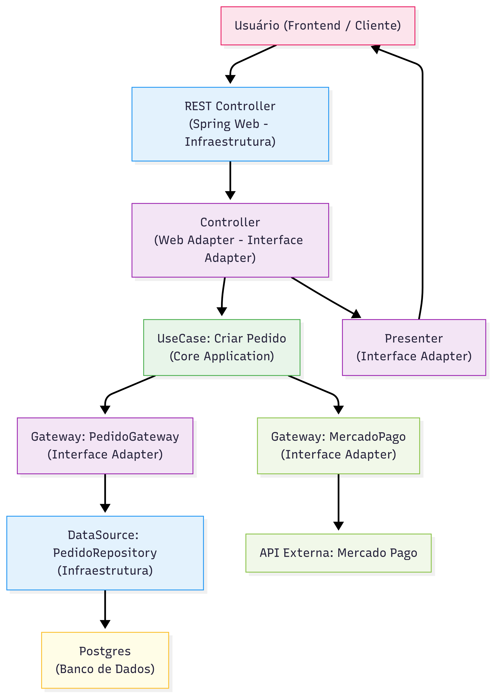
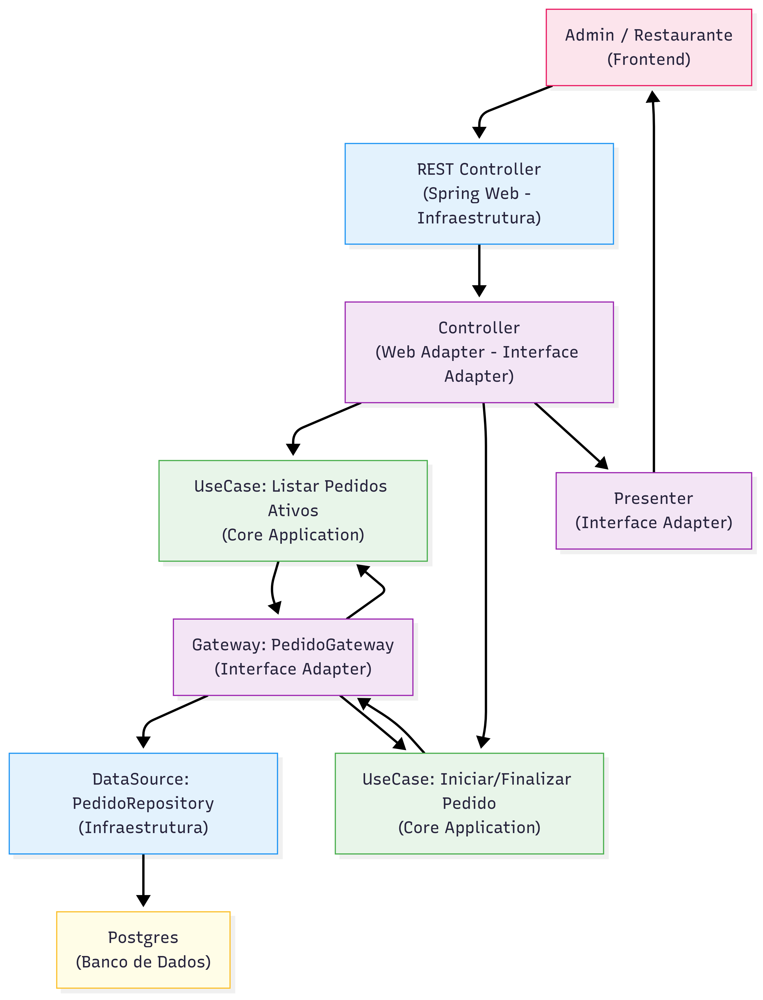
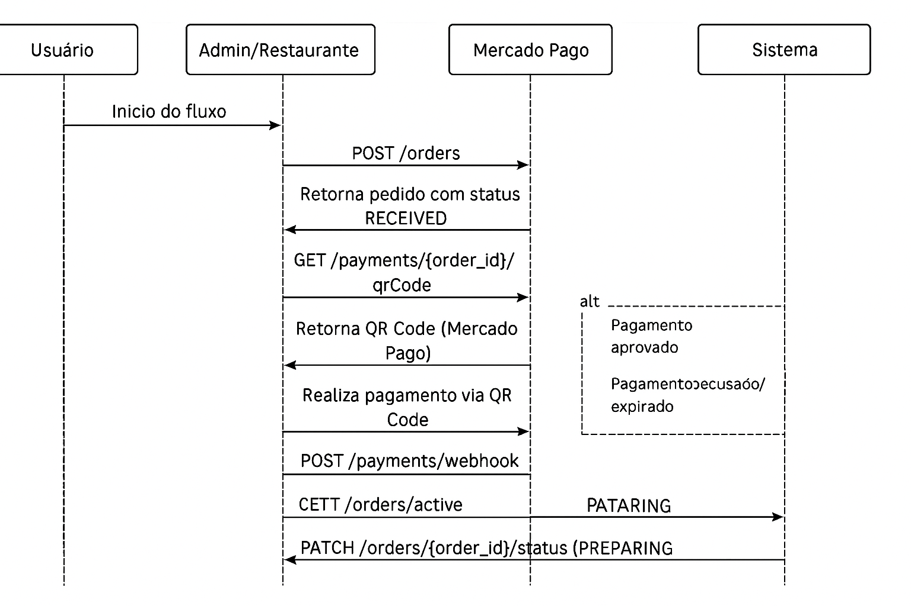

# 🍔 Food Core API

<div align="center">

[](https://sonarcloud.io/summary/new_code?id=FIAP-SOAT-TECH-TEAM_food-core-api)
[](https://sonarcloud.io/summary/new_code?id=FIAP-SOAT-TECH-TEAM_food-core-api)
[](https://sonarcloud.io/summary/new_code?id=FIAP-SOAT-TECH-TEAM_food-core-api)
[](https://sonarcloud.io/summary/new_code?id=FIAP-SOAT-TECH-TEAM_food-core-api)
[](https://sonarcloud.io/summary/new_code?id=FIAP-SOAT-TECH-TEAM_food-core-api)
[](https://sonarcloud.io/summary/new_code?id=FIAP-SOAT-TECH-TEAM_food-core-api)
[](https://sonarcloud.io/summary/new_code?id=FIAP-SOAT-TECH-TEAM_food-core-api)
</div>

API de gerenciamento de pedidos para restaurantes fast-food, desenvolvida como parte do curso de Arquitetura de Software
da FIAP (Tech Challenge).

<div align="center">
  <a href="#visao-geral">Visão Geral</a> •
  <a href="#arquitetura">Arquitetura</a> •
  <a href="#infra">Infraestrutura</a> •
  <a href="#tecnologias">Tecnologias</a> •
  <a href="#diagramas">Diagramas</a> •
  <a href="#eventstorming">Event Storming</a> •
  <a href="#taskboard">Task Board</a> •
  <a href="#dicionario">Dicionário de linguagem ubíqua</a> •
  <a href="#instalacao-e-uso">Instalação e Uso</a> •
  <a href="#provisionamento-na-nuvem">Provisionar o projeto na nuvem</a> •
  <a href="#cicd-infra">Governança e Fluxo de Deploy</a> •
  <a href="#teste-de-carga">Testes de carga</a> •
  <a href="#estrutura-do-projeto">Estrutura do Projeto</a> •
  <a href="#apis">APIs</a> •
  <a href="#banco-de-dados">Banco de Dados</a> •
  <a href="#resolucao-de-problemas">Resolução de Problemas</a> •
  <a href="#contribuicao-e-licenca">Contribuição e Licença</a>
</div><br>

> 📽️ Vídeo de demonstração da arquitetura: [https://www.youtube.com/watch?v=soaATSbSRPc](https://www.youtube.com/watch?v=XgUpOKJjqak)<br>

<h2 id="visao-geral">📋 Visão Geral</h2>

O sistema implementa um serviço de autoatendimento para uma lanchonete de fast-food, permitindo que os clientes façam
pedidos e acompanhem o status em tempo real sem a necessidade de interação com um atendente.
Além disso, um painel administrativo permite o gerenciamento de produtos, categorias e acompanhamento operacional dos pedidos.

Agora, o **gerenciamento de usuários e autenticação** foi completamente extraído da aplicação principal, sendo delegado
a uma **Azure Function em .NET 9** que se integra com o **Amazon Cognito** para autenticação, autorização e emissão de tokens JWT.

### Principais recursos

- **Autoatendimento**: Interface para clientes realizarem pedidos
- **Identificação de cliente**: Via CPF, e-mail ou modo guest (não identificado)
- **Pagamentos via QRCode do Mercado Pago**
- **Acompanhamento de pedido**: Status em tempo real (Recebido, Em preparação, Pronto, Finalizado)
- **Painel administrativo**: Gerenciamento de produtos, categorias e pedidos

---

<h2 id="arquitetura">🧱 Arquitetura</h2>
<details>
<summary>Expandir para mais detalhes</summary>

O sistema foi reestruturado para **desacoplar completamente a autenticação e autorização do core da aplicação**, adotando
uma arquitetura orientada a eventos e serviços externos.
A **FoodCore API** mantém o domínio puro seguindo **Clean Architecture**, enquanto a autenticação ocorre antes da chegada da requisição — no **APIM + Azure Function + Cognito**.

### 🎯 Princípios Adotados

- O **core** permanece independente de frameworks e regras de autenticação
- **Azure APIM** atua como **API Gateway**, validando tokens e redirecionando chamadas
- **Azure Function (.NET 9)** realiza a **autenticação via Cognito** e gera JWTs
- **Amazon Cognito** centraliza **identidade, roles e permissões**
- **JWT** carrega as claims necessárias (CPF, e-mail, role, data de criação)
- **Implicit deny**: qualquer falha de autenticação ou permissão resulta em bloqueio imediato

---

### 🧩 Fluxo de Autenticação e Autorização



---

⚙️ Camadas da FoodCore API

A aplicação principal segue os princípios da Arquitetura Limpa (Clean Architecture), mantendo o domínio independente
de detalhes de autenticação e infraestrutura.


---

### Monolito Modular (Spring Modulith)

A aplicação é estruturada como um monolito modular usando Spring Modulith, com contextos limitados (bounded contexts)
bem definidos para cada domínio de negócio.

Cada módulo:

- É autocontido, com seus próprios adaptadores, portas e domínio
- Comunica-se com outros módulos através de eventos de domínio
- Pode ser extraído como um serviço independente no futuro

### Eventos de Domínio

O sistema utiliza eventos de domínio assíncronos entre módulos, permitindo:

- Comunicação desacoplada
- Notificações entre contextos limitados
- Fácil migração para uma arquitetura distribuída no futuro

</details>

<h2 id="infra">🌐 Infraestrutura</h2>
<details>
<summary>Expandir para mais detalhes</summary>

A infraestrutura da aplicação agora é **modularizada em múltiplos repositórios**, cada um com uma responsabilidade específica no ciclo de provisionamento e deploy. Essa separação garante **maior isolamento, governança e segurança** entre os diferentes domínios do sistema.

---

## 🧩 Estrutura de Repositórios

| Repositório | Responsabilidade Principal | Tecnologias Utilizadas |
|--------------|-----------------------------|--------------------------|
| **[foodcore-infra](https://github.com/FIAP-SOAT-TECH-TEAM/foodcore-infra/tree/main)**| Provisionamento de infraestrutura base (Resource Groups, VNET, AKS, Storage, etc.) | Terraform, Azure CLI |
| **[foodcore-db](https://github.com/FIAP-SOAT-TECH-TEAM/foodcore-db/tree/main)** | Criação e configuração do banco de dados (PostgreSQL) | Terraform, Azure Database for PostgreSQL |
| **[foodcore-auth](https://github.com/FIAP-SOAT-TECH-TEAM/foodcore-auth/tree/main)** | Gerenciamento do código, publicação da Azure function e importação no APIM | Terraform, Azure CLI |
| **foodcore-api** *(este repositório)* | Gerenciamento de código, publicação manifestos Kubernetes (Deployments, Services, ConfigMaps, Secrets, Ingress, etc.) e importação no APIM | Kubernetes, Helm, YAML Manifests |

---

## ⚙️ Repositório Atual — `foodcore-api`

Este repositório contém apenas os **recursos relacionados ao Kubernetes**, utilizados para executar e manter a aplicação dentro do cluster AKS.

### Componentes Principais

#### 🧱 Deployments

- Define os **pods** da aplicação principal (`order-api`), configurando:
  - Probes de saúde (`liveness`, `readiness`, `startup`)
  - Limites e requisições de CPU/memória
  - Variáveis de ambiente (via Secrets e ConfigMaps)

#### 🌐 Services & Ingress

- **Services** expõem os pods internamente no cluster
- **Internal Ingress Controller (NGINX)** expõe a API internamente:
  - `/api` → Foocore API
- **Public Ingress Controller (NGINX)** expõe serviços de observabilidade publicamente:
  - `/kibana` → Logging
  - `/adminer` → Interface de banco de dados
  - `/prometehus` → Coleta de métricas
  - `/grafana` → Dashboard de métricas
  - `/zipkin` → Tracing

#### 🧭 ConfigMaps & Secrets

- **ConfigMaps** armazenam configurações não sensíveis (como endpoints externos e parâmetros de execução)
- **Secrets** contêm credenciais criptografadas, como tokens de APIs externas (Mercado Pago).

#### ⚖️ Horizontal Pod Autoscaler (HPA)

- Ajusta dinamicamente o número de pods com base no uso de **CPU e memória**
- Garante **alta disponibilidade e eficiência de custo**

---

## 🔍 Observabilidade

A aplicação envia logs e métricas para o namespace de observabilidade, utilizando as stacks:

- **EFK (Elasticsearch, Fluentd, Kibana)**
- **Prometheus e Grafana**
- **Zipkin**

Isso permite monitorar o comportamento da aplicação em tempo real, detectar falhas e gerar alertas proativos.

---

## ✅ Benefícios da Nova Estrutura

- **Separação de responsabilidades clara** entre infraestrutura, banco e aplicação
- **Segurança aprimorada**, com permissões limitadas por repositório
- **Escalabilidade modular**, permitindo atualizações independentes
- **Ciclos de deploy simplificados**, especialmente em pipelines CI/CD
- **Escalabilidade automática com HPA**
- **Observabilidade centralizada com EFK**
- **Roteamento seguro e flexível via NGINX**
- **Separação clara de responsabilidades por namespace**
- **Alta disponibilidade e performance no AKS**

---

</details>

<h2 id="tecnologias">🔧 Tecnologias</h2>

<details>
<summary>Expandir para mais detalhes</summary>

### Backend

- **Java 21**: Linguagem principal
- **Spring Boot 3.4**: Framework base
- **Spring Modulith**: Para organização modular da aplicação
- **Spring Data JPA**: Persistência e acesso a dados
- **MapStruct**: Mapeamento entre DTOs e entidades
- **Lombok**: Redução de código boilerplate

### Banco de Dados

- **PostgreSQL**: Banco de dados relacional principal
- **Liquibase**: Migrações de banco de dados

### Infraestrutura & Observabilidade

- **Docker**: Containerização
- **Docker Compose**: Orquestração de containers
- **Kubernetes (AKS)**: Orquestração de containers em produção
- **Terraform**: Provisionamento de infraestrutura como código
- **Gradle**: Gerenciamento de dependências e builds
- **SonarQube/SonarCloud**: Análise estática de código
- **Azure Blob Storage**: Armazenamento de imagens com o Azure Blob Storage
- **GitHub Actions**: CI/CD
- **Swagger/OpenAPI**: Documentação de API

### Integração

- **Mercado Pago API**: Processamento de pagamentos

</details>

<h2 id="diagramas">📊 Diagramas</h2>

<details>
<summary>Expandir para mais detalhes</summary>

### Modelo de Domínio



---

### 🛒 Fluxo de Realização do Pedido e Pagamento



#### 🎯 Fluxo Clean Arch



---

### 🍳 Fluxo de Preparação e Entrega do Pedido


#### 🎯 Fluxo Clean Arch



---

### 💳 Fluxo de Compra e Pagamento

#### 📈 Diagrama Sequencial



</details>

<h2 id="eventstorming"> 💡Event Storming</h2>
<details>
<summary>Expandir para mais detalhes</summary>

### Event Storming Miro

- <https://miro.com/app/board/uXjVIAFD_zg=/?share_link_id=933422566141>


</details>

<h2 id="taskboard"> 📌Task Board</h2>
<details>
<summary>Expandir para mais detalhes</summary>

### Board de tarefas Linear App


</details>

<h2 id="dicionario">📖 Dicionário de linguagem ubíqua</h2>
<details>
<summary>Expandir para mais detalhes</summary>

### Termos essenciais para a aplicação

- **Admin (Administrador)**
  Usuário com privilégios elevados, responsável pela gestão de usuários, permissões e configurações do sistema.

- **Adquirente**
  Instituição financeira responsável por processar transações de pagamento do sistema. No nosso caso, a adquirente é
  representada pela integração com o [Mercado Pago](https://www.mercadopago.com.br).

- **Authentication (Autenticação)**
  Processo de validação da identidade de um usuário por meio de login.

- **Authorization (Autorização)**
  Controle de acesso baseado em permissões e papéis (roles). Exemplo: apenas administradores podem listar todos os
  usuários.

- **Catalog (Catálogo de Produtos)**
  Conjunto organizado dos produtos disponíveis para seleção e montagem de pedidos.

- **Category (Categoria)**
  Classificação dos produtos por tipo (ex.: lanches, bebidas, sobremesas).

- **Combo**
  Conjunto personalizado por um cliente, composto por: lanche, acompanhamento, bebida e sobremesa.

- **Customer (Cliente)**
  Pessoa que realiza um pedido no sistema. Pode se identificar com CPF, cadastrar nome/e-mail ou seguir como convidado (
  guest).

- **Guest (Convidado)**
  Cliente que realiza um pedido sem se identificar ou criar conta. Atua como usuário temporário.

- **Mercado Pago Integration (Integração com Mercado Pago)**
  Serviço externo utilizado para processar pagamentos eletrônicos dos pedidos.

- **Order (Pedido)**
  Conjunto de itens selecionados por um cliente para consumo. Pode incluir um ou mais combos.

- **Order Item (Item do Pedido)**
  Produto específico dentro de um pedido. Pode ser parte de um combo ou avulso.

- **Payment (Pagamento)**
  Etapa posterior à finalização do pedido. Utiliza integração com o Mercado Pago para processar as transações
  financeiras.

- **Expiração (Pagamento)**
  Tempo de expiração para pagamento de QrCode gerado pelo adquirente. Por padrão, 30 minutos, após esgotar o tempo o
  pedido relacionado é cancelado.

- **Product (Produto)**
  Qualquer item disponível para venda, como lanches, bebidas, sobremesas ou acompanhamentos.

- **Role (Papel)**
  Função atribuída a um usuário. Define suas permissões de acesso no sistema (ex.: ADMIN, ATENDENTE, GUEST).

- **Status do Pedido**
  Representa o estado atual de um pedido. Exemplos: *Em preparação*, *Pronto*, *Entregue*, *Cancelado*.

- **Stock (Estoque)**
  Representa a quantidade disponível de cada produto no sistema.

- **TID (Transaction ID)**
  Identificador único de uma transação na adquirente, fornecido após o pagamento.

- **User (Usuário)**
  Pessoa autenticada no sistema. Pode possuir diferentes papéis, como ADMIN, ATENDENTE ou GUEST.

</details>

<h2 id="instalacao-e-uso">🚀 Instalação e Uso</h2>

<details>
<summary>Expandir para mais detalhes</summary>

### Requisitos

- Docker e Docker Compose
- Ngrok (para testes locais de webhook)
- JDK 21+
- Gradle 8.0+

### Script Centralizador `food`

O projeto utiliza um script centralizador `food` para gerenciar todas as operações:

```bash
./food [comando] [opções]
```

#### Comandos Principais

| Comando       | Descrição                                           |
|---------------|-----------------------------------------------------|
| `start:all`   | Inicia toda a infraestrutura e a aplicação          |
| `start:infra` | Inicia apenas a infraestrutura (banco)              |
| `start:app`   | Inicia apenas a aplicação                           |
| `stop:all`    | Para todos os serviços                              |
| `stop:infra`  | Para apenas a infraestrutura                        |
| `stop:app`    | Para apenas a aplicação                             |
| `restart:all` | Reinicia todos os serviços                          |
| `restart:app` | Reinicia apenas a aplicação                         |
| `db:up`       | Aplica migrações do banco de dados                  |
| `db:reset`    | Reseta o banco de dados                             |
| `logs`        | Exibe logs dos containers                           |
| `logs:app`    | Exibe logs apenas da aplicação                      |
| `logs:db`     | Exibe logs apenas do banco de dados                 |
| `status`      | Exibe status dos containers                         |
| `clean`       | Remove containers, imagens e volumes não utilizados |
| `help`        | Exibe a mensagem de ajuda                           |

#### Opções

- `--build`, `-b`: Reconstrói as imagens antes de iniciar
- `--force`, `-f`: Força a execução sem confirmação

### Iniciando o Ambiente do Zero

### 🛠️ Como configurar o ambiente local com Ngrok

Para que sua aplicação local receba os webhooks de forma funcional (especialmente em endpoints que estão em `localhost`), é necessário utilizar o [Ngrok](https://ngrok.com/).

### ⚙️ Passo a passo para configurar o Ngrok

1. **Baixe o Ngrok:**
    - Acesse: [https://ngrok.com/download](https://ngrok.com/download) e faça o download de acordo com seu sistema operacional.

2. **Instale e autentique o Ngrok (apenas na primeira vez):**

   ```bash
   ngrok config add-authtoken SEU_TOKEN_DO_NGROK

3. **Exponha a porta da aplicação:**

   ```bash
   ngrok http 80
   ```

4. **Copie o link gerado:**
    - O Ngrok irá gerar uma URL do tipo `https://abc123.ngrok.io` que redireciona para `http://localhost`.

5. **Atualize o .env:**
    - No arquivo `docker\.env`, adicione a URL do Ngrok como base para os webhooks (não esqueça de adicionar o caminho `/api/payments/webhook` para que o webhook funcione corretamente):

   ```properties
   MERCADO_PAGO_NOTIFICATION_URL=https://abc123.ngrok.io/api/payments/webhook
   ```

Com o Ngrok configurado, agora precisamos subir a aplicação.

>### ⚠️ Ambientes
>
>O projeto suporta diferentes ambientes com diferentes conjuntos de dados:
>
>- **Produção (perfil: prod)**: Apenas dados essenciais
>- **Desenvolvimento (perfil: dev/local)**: Dados essenciais + dados adicionais para testes
>
>Por default, a aplicação iniciará em modo produção. Caso deseje alterar, edite `docker\.env` com o perfil escolhido:
>
>```bash
>SPRING_PROFILES_ACTIVE=nome_do_perfil
>```

### Iniciando a Aplicação Localmente (via Docker Compose)

```bash
# Clone o repositório
git clone https://github.com/soat-fiap/food-core-api.git
cd food-core-api
cd docker

# Execute a aplicação
docker compose up -d
```

### Iniciando a Aplicação Localmente (via Script Centralizador)

```bash
# Clone o repositório
git clone https://github.com/soat-fiap/food-core-api.git
cd food-core-api

# Baixar o dos2unix para converter os arquivos de script
sudo apt install dos2unix     # Debian/Ubuntu
brew install dos2unix         # macOS

# Converter os arquivos de script para o formato Unix
dos2unix food scripts/*.sh

# Tornar o script principal executável
chmod +x food scripts/*.sh

# Iniciar infraestrutura (banco, adminer)
./food start:infra

# Resetar e configurar o banco de dados
./food db:reset

# Iniciar a aplicação
./food start:app --build

# Ou iniciar tudo de uma vez
./food start:all --build
```

> ⚠️ O pacote `dos2unix` é necessário pois os scripts foram criados em ambiente Windows e podem conter quebras de linha no formato `CRLF`, incompatíveis com sistemas `Unix`.

> ⚠️ Para testar todos os recursos da API é necessário criar um azure blob storage e configura-lo no .env do docker compose (AZURE_STORAGE_CONNECTION_STRING) antes de iniciar a aplicação, mas isso não impede de seguir com o fluxo de realização de pedidos.

### Acessando a Aplicação

- **API**: <http://localhost/api>
- **Swagger/OpenAPI**: <http://localhost/api/swagger-ui.html>
- **Adminer (gerenciador de banco de dados)**: <http://localhost:8083>
  - Sistema: PostgreSQL
  - Servidor: db
  - Usuário: postgres
  - Senha: postgres
  - Banco: fastfood

### Testando a Aplicação (Fluxo de compra 🛒)

> ⚠️ O fluxo completo requer dados de catálogos, produtos e estoque, que são automaticamente populados pelos seeders do Liquibase ao iniciar a aplicação.

Para realizar um fluxo de compra na aplicação, você pode seguir os passos abaixo:

1. **Identificação do cliente**:
   O fluxo de autenticação e autorização do cliente foi isolado em uma [Azure Function](https://github.com/FIAP-SOAT-TECH-TEAM/foodcore-auth/tree/main).
   A API tem conhecimento do usúario autenticado atráves de Headers HTTP que o APIM acrescenta após receber uma resposta de validação do token vinda da Azure Function (Foodcore-auth).
   Para simular localmente, em toda requisição, inclua os seguintes Headers contendo detalhes sobre o usúario:

  Cliente identificado:

  ```bash
  Auth-Subject: "c1a2b3c4-d5e6-7890-abcd-ef1234567890"
  Auth-Name: "João da Silva"
  Auth-Email: "joao.silva@exemplo.com"
  Auth-Cpf: "91259416070"
  Auth-Role: "CUSTOMER"
  Auth-CreatedAt: "2025-10-07T02:00:00Z"
  ```

  Cliente não identificado (GUEST):

  ```bash
  Auth-Subject: "c1a2b3c4-d5e6-7890-abcd-ef1234567890"
  Auth-Name: "Guest"
  Auth-Email: "guest@foodcore.com"
  Auth-Cpf: ""
  Auth-Role: "CUSTOMER"
  Auth-CreatedAt: "2025-10-07T02:00:00Z"
  ```

  Admin:

  ```bash
  Auth-Subject: "c1a2b3c4-d5e6-7890-abcd-ef1234567890"
  Auth-Name: "Admin boladão"
  Auth-Email: "admin@foodcore.com"
  Auth-Cpf: "866.756.240-83"
  Auth-Role: "ADMIN"
  Auth-CreatedAt: "2025-10-07T02:00:00Z"
  ```

2. **Realizar Pedido**:
   - Crie um pedido com os produtos disponíveis:

   ```http
   POST /orders
   Content-Type: application/json
   Auth-Subject: "c1a2b3c4-d5e6-7890-abcd-ef1234567890"
   Auth-Name: "João da Silva"
   Auth-Email: "joao.silva@exemplo.com"
   Auth-Cpf: "91259416070"
   Auth-Role: "CUSTOMER"
   Auth-CreatedAt: "2025-10-07T02:00:00Z"
   {
     "items": [
       {
         "productId": 1,
         "name": "X-Burger",
         "quantity": 2,
         "unitPrice": 22.90,
         "observation": "Sem cebola"
       },
       {
         "productId": 2,
         "name": "X-Bacon",
         "quantity": 1,
         "unitPrice": 24.90,
         "observation": "Capricha no bacon"
       }
     ]
   }
   ```

   - Se o pedido for criado com sucesso, o status retornado será RECEIVED.

3. **Acessar QrCode para Pagamento**:
   - Após criar o pedido, você receberá o id do pedido que será utilizado nessa rota para gerar o QrCode.

   ```
    GET /orders/{orderId}/qrCode

    Auth-Subject: "c1a2b3c4-d5e6-7890-abcd-ef1234567890"
    Auth-Name: "João da Silva"
    Auth-Email: "joao.silva@exemplo.com"
    Auth-Cpf: "91259416070"
    Auth-Role: "CUSTOMER"
    Auth-CreatedAt: "2025-10-07T02:00:00Z"
    ```

   - Com o retorno, você poderá copiar o valor de qrCode e utiliza-lo no site [QRCode Monkey](https://www.qrcode-monkey.com/) para gerar o QrCode.

4. **Escaneie o QrCode com o aplicativo do Mercado Pago**:
   - Abra o aplicativo do Mercado Pago e escaneie o QrCode gerado.
   - Siga as instruções para concluir o pagamento.
   - Após o pagamento ser efetuado, o Mercado Pago notificará a aplicação via webhook:

   ```http
   POST /payments/webhook
    ```

  > ⚠️ O endpoint de webhook é público, portanto, não precisa de headers.

- Este webhook atualizará automaticamente o status do pedido para APPROVED. Se o pagamento não for concluído no tempo limite, o status será alterado para CANCELED.

5. **Acompanhar o Status do pagamento do pedido**:
   - Você pode acompanhar o status do pagamento do seu pedido a qualquer momento:

   ```
    GET /payments/{orderId}/status
    Auth-Subject: "c1a2b3c4-d5e6-7890-abcd-ef1234567890"
    Auth-Name: "João da Silva"
    Auth-Email: "joao.silva@exemplo.com"
    Auth-Cpf: "91259416070"
    Auth-Role: "CUSTOMER"
    Auth-CreatedAt: "2025-10-07T02:00:00Z"
    ```

   - Caso o status do pagamento seja `APPROVED`, o pedido foi confirmado e já estará sendo preparado pelo restaurante.

   > ⚠️ O pedido foi alterado para `PREPARING` automaticamente após aprovação do pagamento.

6. **Marcar o pedido como pronto (Admin/Restaurante)**:
    - Quando o pedido estiver pronto, você poderá marca-lo como pronto para que o usuário possa retira-lo:

    ```http
    PATCH /orders/{orderId}/status
    Auth-Subject: "c1a2b3c4-d5e6-7890-abcd-ef1234567890"
    Auth-Name: "Admin boladão"
    Auth-Email: "admin@foodcore.com"
    Auth-Cpf: "866.756.240-83"
    Auth-Role: "ADMIN"
    Auth-CreatedAt: "2025-10-07T02:00:00Z"
    {
      "status": "READY"
    }
    ```

    > ⚠️ Futuramente, o usuário será notificado quando o pedido dele estiver pronto.

7. **Finalizar Pedido (Admin/Restaurante)**:
   - Quando o pedido for retirado pelo cliente, você poderá finalizar o pedido:

    ```http
    PATCH /orders/{orderId}/status
    Auth-Subject: "c1a2b3c4-d5e6-7890-abcd-ef1234567890"
    Auth-Name: "Admin boladão"
    Auth-Email: "admin@foodcore.com"
    Auth-Cpf: "866.756.240-83"
    Auth-Role: "ADMIN"
    Auth-CreatedAt: "2025-10-07T02:00:00Z"
    Content-Type: application/json
    {
      "status": "COMPLETED"
    }
    ```

8. **Verificar pedido finalizado (Admin/Restaurante)**:
   - Você pode verificar o status do pedido a qualquer momento:

    ```
    GET /orders/{orderId}
    Auth-Subject: "c1a2b3c4-d5e6-7890-abcd-ef1234567890"
    Auth-Name: "Admin boladão"
    Auth-Email: "admin@foodcore.com"
    Auth-Cpf: "866.756.240-83"
    Auth-Role: "ADMIN"
    Auth-CreatedAt: "2025-10-07T02:00:00Z"
    ```

   - O status final será `COMPLETED` quando o pedido for retirado pelo cliente.
   - O pedido finalizado também não aparecerá mais na lista de pedidos ativos:

    ```
    GET /orders/active
    Auth-Subject: "c1a2b3c4-d5e6-7890-abcd-ef1234567890"
    Auth-Name: "Admin boladão"
    Auth-Email: "admin@foodcore.com"
    Auth-Cpf: "866.756.240-83"
    Auth-Role: "ADMIN"
    Auth-CreatedAt: "2025-10-07T02:00:00Z"
    ```

</details>

<h2 id="provisionamento-na-nuvem">☁️ Como provisionar todo o projeto (ordem de execução)</h2>
<details>
<summary>Expandir para mais detalhes</summary>

Para subir o projeto completamente, acesse a documentação dos repositórios na sequencia abaixo e siga o passo a passo de cada um deles.

1. [Foodcore-infra](batata.com)
2. [Foodcore-db](batata.com)
3. [Foodcore-auth](batata.com)
4. [Este repositório](https://github.com/FIAP-SOAT-TECH-TEAM/foodcore-api/tree/main#cicd-infra).

</details>

<h3 id="cicd-infra">🔐 Governança e Fluxo de Deploy de Infraestrutura</h3>
<details>
<summary>Expandir para mais detalhes</summary>

A gestão da infraestrutura segue um processo **automatizado, auditável e controlado** via **Pull Requests** no repositório de provisionamento.
Esse fluxo garante segurança, rastreabilidade e aprovação formal antes de qualquer mudança aplicada em produção.

---

### ⚙️ Processo de Alterações

1. **Criação de Pull Request**
   - Todas as alterações de infraestrutura (novos recursos, updates, ou ajustes de configuração) devem ser propostas via **Pull Request (PR)**.
   - O PR contém os arquivos `.tf` modificados e uma descrição detalhando o impacto da mudança.

2. **Execução Automática do Terraform Plan**
   - Ao abrir o PR, o pipeline de CI executa automaticamente o comando:

     ```
     terraform plan
     ```

   - Esse passo gera uma **prévia das alterações** que seriam aplicadas (criações, destruições, atualizações).
   - O resultado do `plan` é exibido diretamente nos logs do pipeline, permitindo revisão técnica pelos aprovadores.

3. **Revisão e Aprovação**
   - O repositório é **protegido**, exigindo no mínimo **1 aprovação** de um codeowner antes do merge.
   - Nenhum usuário pode aplicar alterações diretamente na branch principal (`main` ou `master`).
   - Revisores devem garantir:
     - Que o `plan` não tenha destruições indevidas (`destroy`)
     - Que as variáveis e roles estejam corretas
     - Que os módulos sigam o padrão organizacional
   - Todos os checks(ex: jobs do github actions, sonarQube, etc..) estipulados nas regras de proteção devem estar passando.

4. **Aplicação no Merge**
   - Após aprovação e merge do PR, o pipeline executa automaticamente:

     ```
     terraform apply -auto-approve
     ```

   - O **Terraform Apply** aplica as alterações descritas no `plan` aprovado, provisionando ou atualizando os recursos no Azure.

---

### 🚀 Benefícios do Processo

- **Segurança e controle total** sobre modificações de infraestrutura
- **Auditoria completa**: todo histórico de mudanças é versionado no Git
- **Padronização**: alterações seguem pipeline validado e reproduzível
- **Automação completa**: sem necessidade de execuções manuais
- **Aprovação obrigatória dupla**, reduzindo risco de erro humano

📘 *Esse fluxo assegura que qualquer modificação de infraestrutura passe por revisão técnica e aprovação explícita, mantendo a conformidade e a integridade dos ambientes.*

</details>

<h2 id="teste-de-carga">🔋 Teste de carga</h2>
<details>
<summary>Expandir para mais detalhes</summary>

### Requisitos

- **K6**: Para testes de carga ([instalação](#6-k6))

#### Instalação

```bash
# macOS
brew install k6

# Windows (choco)
choco install k6

# Linux (Ubuntu)
sudo apt install gnupg ca-certificates
curl -fsSL https://dl.k6.io/key.gpg | sudo gpg --dearmor -o /usr/share/keyrings/k6-archive-keyring.gpg
echo "deb [signed-by=/usr/share/keyrings/k6-archive-keyring.gpg] https://dl.k6.io/deb stable main" | sudo tee /etc/apt/sources.list.d/k6.list
sudo apt update
sudo apt install k6

# Verifique a instalação
k6 version
```

### Execute teste de estresse com K6

```bash
k6 run foodcore-api/scripts/stress/stress-test.js
```

</details>

<h2 id="estrutura-do-projeto">📁 Estrutura do Projeto</h2>

<details>
<summary>Expandir para mais detalhes</summary>

O projeto segue uma estrutura modular organizada por domínios:

```
food-core-api/
│
├── src/
│   ├── main/
│   │   ├── java/com/soat/fiap/food/core/api/
│   │   │   ├── FoodCoreApiApplication.java     # Aplicação principal
│   │   │   │
│   │   │   ├── catalog                         # Módulo responsável pelo catálogo (catálogos, categorias e produtos)
│   │   │   │   ├── core                        # Camada de domínio e aplicação
│   │   │   │   │    ├── application            # Casos de uso e DTOs de entrada
│   │   │   │   │    ├── domain                 # Entidades, VOs, eventos e exceções do domínio
│   │   │   │   │    └── interfaceadapters
│   │   │   │   │        ├── bff                # Camada de interface web (controllers e presenters)
│   │   │   │   │        ├── dto                # DTOs e mapeadores da camada de apresentação
│   │   │   │   │        └── gateways           # Interfaces dos gateways (ports de saída)
│   │   │   │   └── infrastructure              # Implementações técnicas (web, persistência, eventos, configurações)
│   │   │   │
│   │   │   ├── order                           # Módulo responsável pelos pedidos
│   │   │   │     ├── core                      # Lógica de domínio e regras de negócio
│   │   │   │     └── infrastructure            # Implementações de persistência, web e eventos
│   │   │   │
│   │   │   ├── payment                         # Módulo responsável pelos pagamentos e integração com Mercado Pago
│   │   │   │   ├── core                        # Casos de uso, entidades, eventos e VOs de pagamento
│   │   │   │   └── infrastructure              # Web, integração externa (Mercado Pago) e persistência
│   │   │   │
│   │   │   ├── shared/                         # Componentes compartilhados
│   │   │   │   ├── core                        # VOs e exceções genéricas
│   │   │   │   ├── interfaceadapters           # Gateways genéricos e DTOs utilitários
│   │   │   │   └── infrastructure              # Configurações globais, autenticação JWT, eventos e storage
│   │   │
│   │   └── resources/
│   │       ├── application.yml                 # Configurações gerais
│   │       ├── application-dev.yml             # Configurações de desenvolvimento
│   │       ├── application-prod.yml            # Configurações de produção
│   │       └── db/changelog/                   # Migrações Liquibase
│   │
│   └── test/                                   # Testes
│
├── docker/                                     # Arquivos Docker
│   ├── Dockerfile
│   ├── docker-compose.yml
│   └── services/                               # Serviços adicionais
│
│
├── kubernetes/
│   └── foodcoreapi/                            # Chart Helm principal da aplicação
│       ├── Chart.yaml                          # Metadata do chart
│       ├── Chart.lock                          # Dependências travadas
│       ├── values.yaml                         # Configurações parametrizáveis do chart
│       ├── assets/                             # Armazena recursos estaticos como dashboards
│       └── templates/                          # Templates Helm
│           ├── api/                            # Subcomponentes da API
│           ├── common/                         # Componentes reutilizáveis
│           ├── efk/                            # Stack EFK para logging
│           └── monitor/                        # Stack de monitoramento (Prometehus, Grafana e Zipkin)

│
│
├── terraform/
│   ├── main.tf                                 # Composição dos módulos e recursos
│   ├── datasource.tf                           # Recurso para recuperar valores já provisionados no provedor de nuvem
│   ├── variables.tf                            # Variáveis globais
│   └── modules/                                # Módulos reutilizáveis para recursos Azure
│       ├── apim/                               # Importação da API ao Azure API Gateway
│       └── helm/                               # Publicação do Helm
│
├── scripts/                                    # Scripts de gerenciamento
│
├── docs/                                       # Documentação
│
├── food                                        # Script centralizador
└── README.md                                   # Este arquivo
```

### 🧱 Estrutura Modular (Clean Architecture)

Cada módulo (ex: `catalog`, `order`, `payment`, etc.) segue a mesma estrutura padrão, baseada nos princípios da Clean Architecture, com separação clara entre regras de negócio, adaptação e infraestrutura.

```
módulo/                                 # Módulo da aplicação (ex: catalog)
├── core/                               # Camada de domínio e aplicação (Core Business Rules)
│   ├── application/                    # Camada de aplicação (Application Business Rules)
│   │   ├── inputs/                     # DTOs de entrada para casos de uso
│   │   │   └── mappers/                # Mapeadores Input -> Domínio
│   │   └── usecases/                   # Casos de uso (Application Business Rules)
│   ├── domain/                         # Camada de domínio (Domain Business Rules)
│   │   ├── model/                      # Entidades de domínio
│   │   ├── events/                     # Eventos de domínio
│   │   ├── exceptions/                 # Exceções de domínio
│   │   └── vo/                         # Objetos de valor
│   └── interfaceadapters/              # Camada de adaptação (Interface Adapters)
│       ├── bff/                        # Camada de interface web (BFF - Backend for Frontend)
│       │   └── controller/web/api      # Controllers REST (BFF)
│       ├── presenter/web/api           # Saídas dos casos de uso (Presenter -> ViewModel)
│       ├── dto/                        # DTOs intermediários
│       │   └── mappers/                # Mapeadores DTO <-> Domínio
│       └── gateways/                   # Interfaces de acesso a recursos externos (ex: repos)
└── infrastructure/                     # Camada de infraestrutura (Frameworks e Drivers)
    ├── common/                         # Fontes genéricas, utilitários
    │   └── source                      # DataSource do módulo
    ├── in/                             # Camada de entrada
    │   ├── event/listener/             # Listeners de eventos internos/externos
    │   └── web/api/controller/         # REST controllers (controllers exposto ao mundo externo)
    │       └── dto/                    # DTOs de entrada/saída (web layer)
    ├── out/                            # Camada de saída para sistemas externos
    │   └── persistence/                # Persistência de dados
    │       └── postgres/               # Implementação específica para PostgreSQL
    │           ├── entity/             # Entidades JPA
    │           ├── mapper/             # Mapper Entity <-> Domain
    │           └── repository/         # Implementações de repositórios
    └── config/                         # Configurações específicas do módulo
```

</details>

<h2 id="apis">🌐 APIs</h2>

<details>
<summary>Expandir para mais detalhes</summary>

O sistema expõe duas interfaces principais de API:

1. **API de Auto-Atendimento**: Para clientes se identificarem, visualizarem produtos e fazerem pedidos
2. **API de Gestão**: Para administradores gerenciarem produtos, categorias e pedidos

### Endpoints Principais

#### Catálogo

```
GET  /api/catalogs                          # Listar todos os catálogos
GET  /api/catalogs/{id}                     # Listar catálogo por ID
POST /api/catalogs                          # Criar catálogo
GET /api/catalogs/{id}/categories           # Listar categorias de um catálogo
POST /api/catalogs/{id}/categories          # Criar categoria no catálogo
GET /api/catalogs/{id}/products             # Listar produtos de uma categoria
POST /api/catalogs/{id}/products            # Criar produto na categoria
GET /api/catalogs/{id}/products/{productId} # Obter produto por ID
```

#### Pedidos

```
POST  /api/orders                        # Criar pedido
PATCH /api/orders/{id}/status            # Atualizar status do pedido
GET   /api/orders/active                 # Listar pedidos ativos
```

#### Pagamentos

```
GET  /api/payments/{orderId}/status     # Obter status do pagamento
GET  /api/payments/{orderId}/qrCode     # Obter informações do QRCode de pagamento
POST /api/payments/webhook              # Webhook de notificação de pagamento
```

Para documentação completa e interativa, consulte o Swagger/OpenAPI disponível em:
<http://localhost/swagger-ui.html>

</details>

<h2 id="banco-de-dados">💾 Gerenciamento de Migrações</h2>

<details>
<summary>Expandir para mais detalhes</summary>

### Gerenciamento de Migrações

O projeto utiliza `Liquibase` para gerenciar migrações de banco de dados, organizadas por módulo:

```
src/main/resources/db/changelog/
├── db.changelog-master.yaml          # Arquivo principal
├── modules/                          # Migrations separadas por módulo
│   ├── order/
│   │   ├── 01-order-tables.sql
│   │   ├── 02-order-indexes.sql
│   │   └── 03-order-seed.sql
│   ├── catalog/
│   └── payment/
└── shared/
    └── 00-init-schema.sql
```

As migrações são aplicadas automaticamente durante a inicialização da aplicação, mas também podem ser executadas
manualmente:

```bash
./food db:up     # Aplicar migrações
./food db:reset  # Resetar e recriar o banco de dados
```

</details>

<h2 id="resolucao-de-problemas">🔍 Resolução de Problemas</h2>

<details>
<summary>Expandir para mais detalhes</summary>

### Problemas com o Banco de Dados

Se você encontrar erros ao tentar resetar o banco de dados, como:

```
ERROR: database "fastfood" is being accessed by other users
DETAIL: There are X other sessions using the database.
```

Tente estes passos:

```bash
# 1. Parar todos os serviços
./food stop:all

# 2. Limpar recursos Docker não utilizados
./food clean --force

# 3. Iniciar apenas a infraestrutura
./food start:infra

# 4. Tentar o reset novamente
./food db:reset --force
```

### Erros do Liquibase

Se você encontrar erros de validação do Liquibase como:

```
Validation Failed:
     changesets check sum
     changesets had duplicate identifiers
```

Existem duas abordagens:

1. **Limpar completamente o banco de dados:**

```bash
# Parar todos os serviços
./food stop:all

# Limpar recursos
./food clean --force

# Iniciar tudo novamente
./food start:all --build
```

2. **Atualizar a tabela DATABASECHANGELOG (para desenvolvedores):**

```sql
-- Conecte-se ao banco via Adminer e execute:
DELETE FROM DATABASECHANGELOG
WHERE filename = 'db/changelog/modules/product/03-product-seed.sql';

-- Aplique as migrações novamente
./food db:up
```

### Problemas com o Docker

Se o Docker travar ou apresentar problemas:

```bash
# Reinicie o Docker Desktop
# Em seguida, reinicie a infraestrutura
./food restart:all --build
```

### Porta em Uso

Se alguma porta estiver em uso (como 8080, 8081, 8082, 8083, 5432, 6379):

1. Identifique o processo usando a porta:

   ```bash
   lsof -i :<número-da-porta>
   ```

2. Encerre o processo ou altere a porta no arquivo `docker/docker-compose.yml`

</details>

<h2 id="contribuicao-e-licenca">🙏 Contribuição e Licença</h2>

### Guia de Contribuição

Para contribuir com o projeto, siga estas etapas:

#### Branches

- A branch principal de desenvolvimento é a `main`
- Para novas funcionalidades, crie uma branch a partir da `main` seguindo o padrão:
  - `feature/nome-da-funcionalidade`
- Para correções de bugs, use o padrão:
  - `fix/descricao-do-bug`
- Para documentação:
  - `docs/descricao-da-documentacao`
- Para melhorias de performance ou refatoração:
  - `refactor/descricao-da-mudanca`

#### Commits

Siga a convenção [Conventional Commits](https://www.conventionalcommits.org/):

```
<tipo>[escopo opcional]: <descrição>

[corpo opcional]

[rodapé(s) opcional(is)]
```

Exemplos:

- `feat(order): adiciona endpoint para cancelamento de pedido`
- `fix(customer): corrige validação de CPF`
- `docs: atualiza README com novas instruções`
- `refactor(product): melhora desempenho na listagem de produtos`

#### Pull Requests

1. Certifique-se que sua branch está atualizada com a `main`
2. Faça um pull request para a branch `main`
3. Descreva as alterações realizadas de forma clara
4. Vincule issues relacionadas
5. Aguarde a revisão dos mantenedores

---

### Contribuidores

Este projeto é mantido por:

- [Caio Souza](https://github.com/caiuzu)
- [Guilherme Cesar](https://github.com/QuatroQuatros)
- [Marcelo Maga](https://github.com/marcelo-maga)
- [Pedro Ferrarezzo](https://github.com/pedroferrarezzo)

---

### Licença

Este projeto está licenciado sob a licença MIT.
