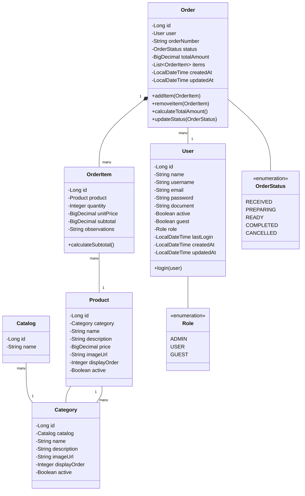
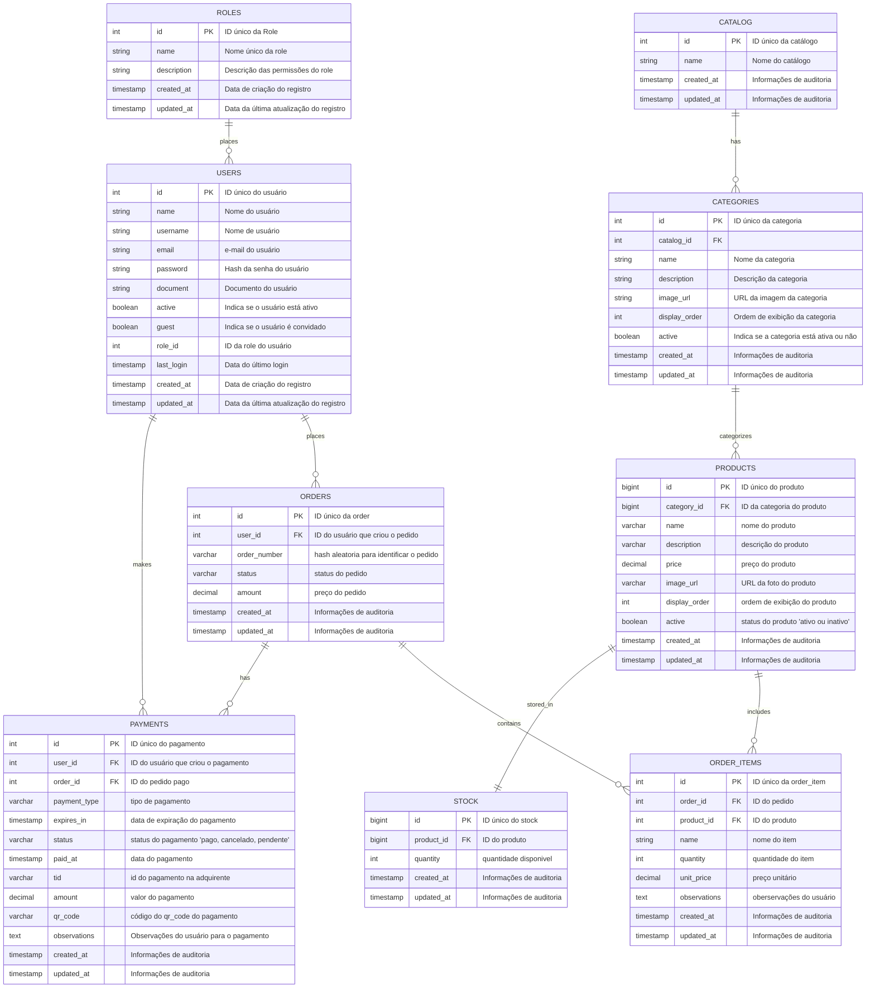
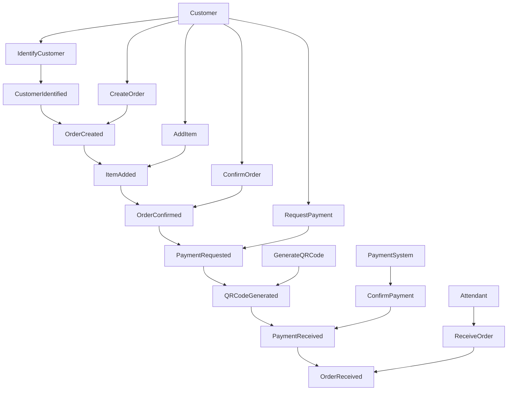
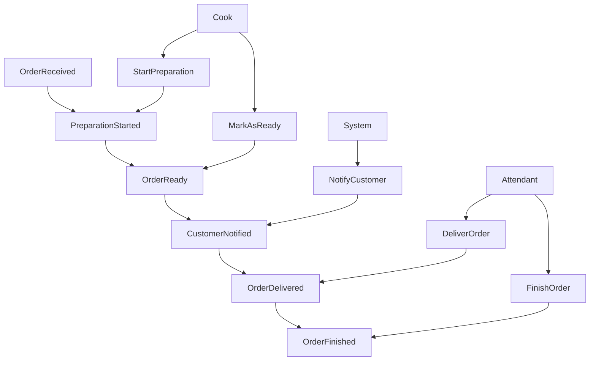

<h2 id="diagramas">📊 Diagramas</h2>

Expandir para mais detalhes

### Modelo de Domínio

### DER (Diagrama Entidade-Relacionamento)

### Fluxo de Realização do Pedido e Pagamento (Event Storming)

### Fluxo de Preparação e Entrega do Pedido (Event Storming)

