<h2 id="diagramas">📊 Diagramas</h2>

Expandir para mais detalhes

### Modelo de Domínio

### DER (Diagrama Entidade-Relacionamento)

```mermaid
erDiagram
    USERS ||--o{ ORDERS : places
    USERS ||--o{ PAYMENTS : makes
    ROLES ||--o{ USERS : places
    ORDERS ||--o{ ORDER_ITEMS : contains
    PRODUCTS ||--o{ ORDER_ITEMS : includes
    PRODUCTS ||--|| STOCK : stored_in
    CATALOG ||--o{ CATEGORIES : has
    CATEGORIES ||--o{ PRODUCTS : categorizes
    ORDERS ||--o{ PAYMENTS : has
    USERS {
        int id PK "ID único do usuário"
        string name "Nome do usuário"
        string username "Nome de usuário"
        string email "e-mail do usuário"
        string password "Hash da senha do usuário"
        string document "Documento do usuário"
        boolean active "Indica se o usuário está ativo"
        boolean guest "Indica se o usuário é convidado"
        int role_id "ID da role do usuário"
        timestamp last_login "Data do último login"
        timestamp created_at "Data de criação do registro"
        timestamp updated_at "Data da última atualização do registro"
    }

    ROLES {
        int id PK "ID único da Role"
        string name "Nome único da role"
        string description "Descrição das permissões do role"
        timestamp created_at "Data de criação do registro"
        timestamp updated_at "Data da última atualização do registro"
    }

    ORDERS {
        int id PK "ID único da order"
        int user_id FK "ID do usuário que criou o pedido"
        varchar order_number "hash aleatoria para identificar o pedido"
        varchar status "status do pedido"
        decimal amount "preço do pedido"
        timestamp created_at "Informações de auditoria"
        timestamp updated_at "Informações de auditoria"
    }

    ORDER_ITEMS {
        int id PK "ID único da order_item"
        int order_id FK "ID do pedido"
        int product_id FK "ID do produto"
        string name "nome do item"
        int quantity "quantidade do item"
        decimal unit_price "preço unitário"
        text observations "oberservações do usuário"
        timestamp created_at "Informações de auditoria"
        timestamp updated_at "Informações de auditoria"
    }

    CATALOG{
        int id PK "ID único da catálogo"
        string name "Nome do catálogo"
        timestamp created_at "Informações de auditoria"
        timestamp updated_at "Informações de auditoria"
    }

    CATEGORIES{
        int id PK "ID único da categoria"
        int catalog_id FK
        string name "Nome da categoria"
        string description "Descrição da categoria"
        string image_url "URL da imagem da categoria"
        int display_order "Ordem de exibição da categoria"
        boolean active "Indica se a categoria está ativa ou não"
        timestamp created_at "Informações de auditoria"
        timestamp updated_at "Informações de auditoria"
    }

    PRODUCTS {
        bigint id PK "ID único do produto"
        bigint category_id FK "ID da categoria do produto"
        varchar name "nome do produto"
        varchar description "descrição do produto"
        decimal price "preço do produto"
        varchar image_url "URL da foto do produto"
        int display_order "ordem de exibição do produto"
        boolean active "status do produto 'ativo ou inativo'"
        timestamp created_at "Informações de auditoria"
        timestamp updated_at "Informações de auditoria"
    }

    STOCK {
        bigint id PK "ID único do stock"
        bigint product_id FK "ID do produto"
        int quantity "quantidade disponivel"
        timestamp created_at "Informações de auditoria"
        timestamp updated_at "Informações de auditoria"
    }

    PAYMENTS {
        int id PK "ID único do pagamento"
        int user_id FK "ID do usuário que criou o pagamento"
        int order_id FK "ID do pedido pago"
        varchar payment_type "tipo de pagamento"
        timestamp expires_in "data de expiração do pagamento"
        varchar status "status do pagamento 'pago, cancelado, pendente'"
        timestamp paid_at "data do pagamento"
        varchar tid "id do pagamento na adquirente"
        decimal amount "valor do pagamento"
        varchar qr_code "código do qr_code do pagamento"
        text observations "Observações do usuário para o pagamento"
        timestamp created_at "Informações de auditoria"
        timestamp updated_at "Informações de auditoria"
    }
```

### Fluxo de Realização do Pedido e Pagamento (Event Storming)

### Fluxo de Preparação e Entrega do Pedido (Event Storming)

